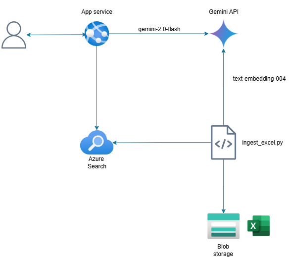

# bot-demandas
## Arquitectura


## Ambiente virtual

```powershell
py -3.12 -m venv .venv
.venv\Scripts\activate
pip install -r requirements.txt
```

## Ejecución bot

```powershell
cd backend
uvicorn main:app --host 0.0.0.0 --port 8000 --reload
```

## Comando de ejecución app service

```powershell
gunicorn -w 2 -k uvicorn.workers.UvicornWorker -b 0.0.0.0:8000 backend.main:app
```


## Creación de índice

```powershell
cd indexacion
python create_index.py
```

## Ingesta de datos al índice

```powershell
cd indexacion
python ingest_excel.py
```